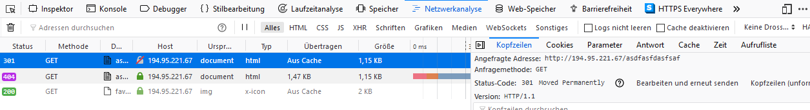

[comment]: <> (Verfasst von Fabian Konrad, 06.02.2019)
[comment]: <> (Dieses Dokument besitzt ein Inhaltsverzeichnis, hierfür muss markdown TOC in Visual Studio Code integriert werden Name des Plugins: joffreykern.markdown-toc)
# Dokumentation der von Fabian Konrad durchgeführten Entwicklungen
##  1. <a name='Inhaltsverzeichnis'></a>Inhaltsverzeichnis
<!-- vscode-markdown-toc -->
* 1. [Inhaltsverzeichnis](#Inhaltsverzeichnis)
* 2. [Motivation und Zielsetzung](#MotivationundZielsetzung)
* 3. [Installation der PHP-Bibliotheken und -Dependencies](#InstallationderPHP-Bibliothekenund-Dependencies)
* 4. [Benutzung von cURL](#BenutzungvoncURL)
* 5. [Sicherheit und Konfiguration des Apache-Servers](#SicherheitundKonfigurationdesApache-Servers)
* 6. [Entwicklungen auf dem Server](#EntwicklungenaufdemServer)
	* 6.1. [Login](#Login)
	* 6.2. [Registrierung](#Registrierung)
	* 6.3. [Generierung des Shared Secrets](#GenerierungdesSharedSecrets)
	* 6.4. [Passwort-Vergessen-Modus](#Passwort-Vergessen-Modus)
	* 6.5. [Anpassungen an der Datenbank](#AnpassungenanderDatenbank)
	* 6.6. [Kommunikation mit der App](#KommunikationmitderApp)
* 7. [Entwicklung des Mobile Agent](#EntwicklungdesMobileAgent)
	* 7.1. [Wahl des Frameworks](#WahldesFrameworks)
	* 7.2. [Das-Entry-Skript](#Das-Entry-Skript)
	* 7.3. [Der HomeScreen](#DerHomeScreen)
	* 7.4. [Die Login-Page](#DieLogin-Page)
	* 7.5. [Der Homescreen für angemeldete User](#DerHomescreenfrangemeldeteUser)
	* 7.6. [Bereitstellung eines Shared Secret über einen QR-Code-Scanner](#BereitstellungeinesSharedSecretbereinenQR-Code-Scanner)
	* 7.7. [Die ergänzenden Skripte](#DieergnzendenSkripte)
	* 7.8. [Start der App](#StartderApp)
* 8. [Fußnoten](#Funoten)

<!-- vscode-markdown-toc-config
	numbering=true
	autoSave=true
	/vscode-markdown-toc-config -->
<!-- /vscode-markdown-toc -->
##  2. <a name='MotivationundZielsetzung'></a>Motivation und Zielsetzung
Für diesen Teil war die primäre Zielsetzung, für die gesamte Architektur eine sichere Übertragung der Daten zu gewährleisten. Dies beginnt bei der Auswahl der Technologie und endet bei der Gestaltung der verschiedenen User-Interaktionen. Überall müssen Komponenten eingebaut werden, die die Sicherheit der Übertragung gewährleisten. Es muss sichergestellt werden, dass kein User seine Bankdaten verliert, genauso wie sichergestellt werden muss, dass seine Daten nicht an Dritte weitergegeben werden können. Beim Thema Sicherheit wurde also angestrebt, diese hoch zu halten, indem das Thema Asynchronität hervorgehoben wurde: Ein Mensch kann innerhalb weniger Sekunden seinen Blick von einem Blatt Papier auf ein Handy und danach auf einen Computer werfen. Währenddessen müssen Computer oder Bots für jedes einzelne Gerät zunächst die Adressen aufdecken, über die sie erreichbar sind. Wenn es nun anschließend um den Zugriff auf die Geräte geht, muss dieser vorher auf dem Computer oder Bot implementiert worden sein. Einen Zettel wird der Computer ohne die Hilfe eines Scanners erst recht nicht lesen können.
Die Sicherheit entsteht folglich dadurch, dass der Mensch technisch weitaus flexibler ist als die Software. Letztendlich bedeutet dies, dass man die höchste Sicherheit ganz einfach gewährleisten kann, nämlich dann, wenn man Autorisierungen durch den User einfordert.
Gerade beim Thema Geld ist eine Autorisierung ein äußerst wichtiges Thema. Aus diesem Grund wurde eine Mobile App konzipiert, die sicherstellt, dass jede Zahlung, jede Transaktion und jede Handlung betreffend des User-Accounts durch einen menschlichen Klick auf einen Button genehmigt wird. So wird auf Höchster Ebene sichergestellt, dass der Mensch, der das Online-Banking-Tool nutzen will, durch sein persönliches Zutun bewiesen hat, dass er ein Mensch ist und kein Bot die wichtigsten User-daten abrufen kann.
Die App unterstützte außerdem eine weitere Zielsetzung, die Usability auf Mobilgeräten zu erhöhen. Seit Jahren wächst bereits der Trend bei der Web-Nutzung immer weiter in Richtung Mobilgerät zu arbeiten und in meinem Fall auch zu entwickeln.
Beim Teilgebiet Sicherheit konnte die Anforderung und Zielsetzung exakt definiert werden: Der Zugriff auf den Webserver muss verschlüsselt erfolgen, den modernsten HTTPS-Standard einsetzen und soll auf einem Browser keine Fehler aufgrund falscher Zertifizierung generieren. Das Beziehen von Zertifikaten muss automatisch erfolgen. Die Einrichtung eines Domain Records ist optional. Zusätzlich soll die Kommunikation mit der App nicht aus Sicherheitsgründen gesperrt werden.
##  3. <a name='InstallationderPHP-Bibliothekenund-Dependencies'></a>Installation der PHP-Bibliotheken und -Dependencies
Um die Entwicklung verschiedener Komponenten, wie dem Mailing-Dienst oder dem Push-Dienst einzurichten, war es nötig verschiedene Bibliotheken einzubinden. Auch der Datenaustausch sollte mit Hilfe von pecl_http, das wesentlich einfacher zu bedienen ist als cURL vereinfacht werden. Der primäre Versuch war es, PECL-Bibliotheken zu nutzen, vor allem die entsprechende PECL HTTP-Bibiliothek. PECL ist ein Repository für verschiedene PHP-Komponenten, die jedoch im Gegensatz zu ordinären PHP-Skripten vorkompiliert sind und im Falle von Windows als eine Dynamic Link Library(DLL) in das PHP-ext (ext steht für hierbei für Extensions, also Erweiterungen) gespeichert werden müssen über das php.ini-File eingebunden werden müssen. Mit PECL bezieht man dementsprechend nur den Source Code, meistens in der Sprache C, den man anschließend mit dem Visual-Studio-C-Compiler zu einer Bibliothek kompilieren muss. Leider war PECL nicht installiert und musste erst über PEAR bezogen werden. PEAR ist eine Paketverwaltung, die normalerweise Teil einer PHP-Distribution ist. Leider war diese auf dem Server nicht funktionsfähig und eine Neuinstallation war nicht möglich, denn die PEAR-Homepage wurde vor wenigen Wochen gehackt, und es stellte sich heraus, dass das Zentrale PHP-Skript dieser Anwendung seit Monaten kontaminiert ist.<sup>[1](#quelleZuPear)</sup> 
Im weiteren Verlauf der Entwicklung, vor allem für die Entwicklung, vor allem für das Generieren der QR-Code-API kam eine weitere, wesentlich einfacher nutzbare PHP-Paketverwaltung ans Licht, der Composer. Der Composer wird einfach als Binary auf dem Server installiert und ist anschließend über den Konsolenbefehl ```$ composer ...``` aufrufbar. Composer ähnelt sehr stark der npm-Paketverwaltung auf node.js und wird sehr ähnlich zu dieser gehandhabt. Über den Befehl ```$ composer require KOMPONENTENNAME``` , der jedoch im selben Pfad wie die Datei aufgerufen wird, kann die entsprechende Komponente aus dem Composer-Repository gemeinsam mit zugehörigen Abhängigkeiten in den Dateipfad installiert werden. Zusätzlich wird eine Datei composer.json erstellt oder erweitert. Diese Datei ist sehr wichtig, da sie über den Befehl ```$ composer install``` aufgerufen werden kann und automatisch alle Abhängigkeiten installiert. Vor allem beim Transfer der Websites auf einen anderen Server ist dies hilfreich, da somit die Dependencies automatisch aus dem Internet abgerufen werden. Aus diesem Grund ist die Installation des Composers auch ein Kernbestandteil der Installation. Der Composer bietet es auch an, einzelne pecl-Komponenten als selbstinstallierende .phar-Dateien abzurufen, und diese dann selbst zu installieren. Zu diesen gehörte auch pecl_http Dieser Bezugsweg funktionierte jedoch am Ende auch nicht. Diese Skripte sind so implementiert, dass sie ihren eigenen Hash-Wert überprüfen und daher keine Veränderungen zulassen. Beim Aufruf einer solchen .phar-Datei konnte somit das Problem, dass Zeilenenden nicht abrufbar waren, da das Carriage-Return-Zeichen nicht gesetzt wurde, nicht durch entsprechende Änderung der Datei gelöst werden. Aus diesem Grund musste endgültig auf Enums und die http()-Funktion verzichtet werden, was zu gewissen Veränderungen in den Skripten ```appdaemon.php``` und ```certificate.php``` führte. Der Composer funktionierte im Gegensatz dazu hervorragend und ermöglichte die Einbindung des PHP-Mailers und des PHP-Qrcode-Tools.
##  4. <a name='BenutzungvoncURL'></a>Benutzung von cURL
cURL ist eine sehr umfangreiche Anwendung, die auf Unix-Systemen teilweise auch als Installer und Skriptsprache verwendet wird. Sie ist grundsätzlich erst einmal dafür zuständig, um TCP/IP-Verbindungen aufzubauen, kann jedoch mit einer Logik und verschiedenen Parametern versehen werden und dadurch als kompletter Installer oder in diesem Use-Case für HTTP-basierten Datenaustausch verwendet werden. PHP unterstützt in der XAMPP-Installation cURL nativ. Dies wird bewerkstelligt, indem das ```php.ini``` auf die ```curl.exe``` (also die cURL-Anwendung) auf dem Apache-Server verweist. Somit lässt sich cURL einfach über verschiedene Funktionen aufrufen. cURL war jedoch zunächst eine Blackbox, da es, wenn es falsch parametrisiert wird, keinen Fehler, sondern einfach nichts ausgibt. Nach längerem Suchen konnte der Verbose-Parameter aktiviert werden, der jedoch den Text in den Error-Stream schob, was beim Testen im Browser unhandlich war, weil dieser sich nicht löscht. Der Ausgabestream von cURL musste zum Testen in den Ausgabestream des Browsers geschoben werden. Da dieser Stream jedoch nicht in einen String geschrieben werden kann, musste er in einen File-Pointer in den RAM geschoben werden, der am Ende wieder in einen String geparst und durch echo an den Browser ausgegeben wird. Die Alternative, das cURL-Logging direkt auf den Ausgabestream zu verweisen funktionierte nicht, da beim direkten Transfer in den Ausgabestream kein Buffering betrieben wird, wie es bei der echo-Funktion der Fall ist. Folglich wurden die Strings ineinander vermischt und waren nicht lesbar.
Mithilfe des Verbose-Parameters konnten die Richtigen cURL-Parameter gefunden werden. Dieser geschilderte Sachzusammenhang sowie die letztendlich gefundenen Parameter sind alle in der Datei ```certificate.php``` eingespeichert, wobei die Parameter für das Verbose auskommentiert werden mussten, da sie sonst im Release die cURL-Logs auf der Website dargestellt werden würden. Hierbei war sehr hilfreich, das cURL-Client-Zertifikat durch das CA-Root-Zertifikat auszutauschen, was dazu führte, dass zumindest das Client-Zertifikat nicht mehr ungültig ist. Für den direkten Zugriff auf die IP-Adresse des Servers musste jedoch der Parameter gesetzt werden, dass die fehlende Servervalidierung ignoriert wird, trotz eines signierten Zertifikates, ansonsten gab cURL nie eine Antwort zurück, weil es die Verbindung ablehnte. Dies zu ignorieren war bei PHP noch möglich, half jedoch nicht mehr im Fall von IOS-Apps, was das Thema Sicherheit noch einmal gänzlich zu seinem Anfang zurückwarf.
##  5. <a name='SicherheitundKonfigurationdesApache-Servers'></a>Sicherheit und Konfiguration des Apache-Servers
In seiner Grundkonfiguration unterstützt der Apache-Server lediglich http über den Port 80 und verzichtet auf jegliche Form der Verschlüsselung. Alleine diese Ports nach außen freizugeben, war bereits eine sehr große Herausforderung, wie in einem anderen Teil dieser Dokumentation erläutert wird. Auch die Umkonfigurierung der Konfigurationsoberfläche, damit sie auch über den normalen WWW-Port 80 und nicht mehr über den entsprechenden Port 8080 abrufbar ist, war sehr komplex. In diesem Teil geht es jedoch darum, die Konfiguration des Servers zu vollenden und einen sichere sowie authentifizierte Verbindung zu ermöglichen. Zunächst war es also das Ziel, HTTPS freizuschalten und anschließend den Client dazu zu zwingen, die Websites auch als HTTPS-Datei anzufordern. Denn bei der Eingabe eines Links ohne Protokollauswahl, also ohne ```"http://"```, ```"https://"``` oder Sonstiges einzugeben, wählt ein Browser und genauso auch eine cURL-, fetch()- oder sonstige API HTTP über Port 80 als Protokoll aus und ruft trotz aktivem HTTPS-Protokoll auf dem Port 443 die Seite unverschlüsselt ab und versendet Requests, die womöglich auch Passwörter beinhalten, zusätzlich auch völlig unverschlüsselt. Die Lösung ist hierbei eine Weiterleitungs-Antwort an den Client. Jegliche Anfrage des Clients an den Port 80 des Servers wird mit einem HTTP 3xx-Paket beantwortet, was immer bedeutet, dass der Server den Client weiterleitet. Um genau zu sein erhält der Client die Meldung ``` "HTTP/1.1 Moved Permanently"```, was entsprechend des W3C auch Standard für eine Weiterleitung nach HTTPS ist.<sup>[2](#HTTP_StatusCodes)</sup>
Dies funktoniert auch bei Websites, die gar nicht existieren. Es wird nie auch nur ein Zugriff auf das Dateiverzeichnis zugelassen, ohne dass die Verschlüsselung aktiviert wurde.

Dies wurde durch das Verwenden der Rewrite-Engine bewerkstelligt. Diese musste in der Konfigurationsdatei ```%xampp%/apache/conf/httpd.conf``` , also der Hauptkonfigurationsdatei des Apache-Servers aktiviert werden. Die entsprechende Konfiguration ist diese:
```ApacheConf
# Anderer Code… 
<Directory "C:/Projekt/xampp/htdocs">
    # Anderer Code…
    # Diese Einstellungen sind nötig, um eine http 301 Weiterleitung für alle Adressen nach https sicherzustellen
    RewriteEngine On
    RewriteCond %{HTTPS} !=on
    RewriteRule ^ https://%{HTTP_HOST}%{REQUEST_URI} [L,R=301]
    # RewriteEngine aktivieren
    # Bedingung für den Rewrite: Request beginnt nicht mit HTTPS
    # Definition der Regel:
    # Regel gilt für alle Anforderungen ^
    # Regel ersetzt den Text http://REQUEST_URI durch https://REQUEST_URI
    # Regel sendet den Link zurück an den Client, HTTP-Statuscode 301
</Directory>
# Anderer Code…
```
Somit werden nun alle Anfragen sicher auf HTTPS umgeleitet. Als nächstes war die Einbindung von Zertifikaten von Relevanz, denn der Browser warnte beim Aufruf einer Seite, dass das Zertifikat unsicher und nicht vertraunswürdig ist. Zunächst einmal musste das alte Zertifikat, also das zu der Serverinstallation gehörende selbst signierte Zertifikat ohnehin ersetzt werden, da es nur mit dem SHA1-Algorithmus verschlüsselt wurde, nicht mit SHA2, einem neueren Hashing-Standard. Aus diesem Grund stand eine längere Auseinandersetzung mit dem Verschlüsselungstool openssl an, was als Teil von Apache mitinstalliert wurde. Zunächst war hierzu die Erstellung eines Config-Files notwendig, da jeder Befehl in Openssl fehlschlägt, wenn keine Konfigurationsdatei existiert. Diese Konfigurationdatei entspricht auch nicht der Standarddatei, da sie so umgebaut wurde, dass der User beim Erstellen einer Zertifikatsanforderung (CSR, Certificate Signing Request) keine Fragen gestellt bekommt und Openssl somit über Kommandzeilenbefehle aufgerufen werden kann.

Die Datei ist unter dem Namen certify_server.cnf abrufbar. Die entsprechende Steuerung sollte auch automatisiert werden. Hierzu wurde alles wurde in ein Powershell-Skript gebündelt. Eine Fortsetzende Nummerierung der Zertifikate wurde auch geplant, war jedoch nicht erfolgreich. Dieses Zertifikat bietet nun die Möglichkeit, durch Klick die gesamte Zertifikatkonfiguration und -signierung automatisch vorzunehmen, jedoch lediglich für selbst signierte Zertifikate. Es wurd zuerst ein Zertifikat erstellt und selbst signiert, das die Rolle des Stammzertifikats einnimmt. Anschließend werden 3 CSRs erstellt, die von diesem Zertifikat signiert und zu echten Zertifikaten umgewandelt werden. Dieses Skript funktioniert völlig autonom, jedoch darf weder dessen Pfad noch der Pfad der Config-Datei verändert werden. Ansonsten würde auch der Server die Zertifikate nicht finden. Um dieses Skript effektiv nutzen zu können, wurden die Pfade in der Server-Konfiguration angepasst. Dies ist in der Datei httpd-ssl.cnf durchgeführt worden. Darüber hinaus wurden dort auch die Sicherheitsstandards erhöht. Es wird für die Übertragung nur noch TLSv1.2 zugelassen, was das sicherste durch den Apache-Server unterstützte Protokoll darstellt. Als später die Implementierung der Datenübertragung mit der Mobile-App anstand, musste letztendlich doch auf selbst signierte Zertifikate verzichtet werden. Hierzu war eine Domain nötig, die anschließend von Let’s encrypt ein Zertifikat erhalten kann. Hierzu wurde zunächst eine Domain bei noip.com registriert, die den Namen fhwswebbankingapp.ddns.net erhielt, denn IP-Adressen ohne DNS-Record können zumindest bei Let’s encrypt keine signierten Zertifikate erhalten. Zusätzlich wurde über den Composer ein php-Skript bezogen und konfiguriert, das automatisch Zertifikate von der entsprechenden Let’s encrypt-API beziehen würde. jedoch benötigt dessen Aktivierung eine Rekonfiguration der virtuellen hosts, was jedoch die Zielsetzung überstieg und daher nicht mehr in Betracht kam. Folglich wurde als Alternative die manuelle Bereitstellung der signierten Zertifikate durchgeführt, die anschließend über das Powershell-Skript weitere Zertifikate signieren würde. Hierzu wurde zunächst über die Website sslforfree.com ein signiertes Zertifikat bezogen. Der Versuch war, das Skript umzubauen, sodass anstelle des selbst signierten Zertifikats das von sslforfree.com erhaltene Zertifikat als Stammzertifikat verwendet wird und anschließend die 3 weiteren Zertifikate signiert. Dies funktionierte zwar, war jedoch nicht hilfreich, da die Konfiguration so hätte angepasst werden müssen, dass die Zertifikate als Baum in ein Zertifikat gepackt werden. Auch dies überstieg jedoch die Zielsetzung des Projekts und es blieb am Ende bei zwei Alternativen: Entweder werden die Zertifikate automatisch über ein Skript bereitgestellt, das in regelmäßigen Zeitabständen durch die Windows-Augabenplanung aufgerufen wird, oder man bezieht alle 90 Tage über den Webdienst sslforfree.com ein offiziell signiertes Zertifikat und ordnet es dem korrekten Pfad zu. Diese Pfade mussten alle genau in httpd-ssl.cnf genau definiert werden. Weitere Veränderungen befinden sich mit entsprechenden Dokumentationen in dieser Datei. Das PowerShell1-Skript, das für die Automatisierung notwendig ist, befindet sich im Anhang dieses Dokuments. Bei der Wahl des selbst signierten Zertifikates ist die Kommunikation mit IOS jedoch nicht mehr garantiert aktuell muss die info.plist-Datei geändert werden, um die Sicherheitsausnahme zu genehmigen. Das exakte Verfahren zur Genehmigung der Sicherheitsausnahme auf einem Mobilgerät ist jedoch nicht beständig und wird von Apple häufig verändert.
```PowerShell
#Root-Zertifikat ausstellen und direkt signieren
openssl req -x509 -newkey rsa:4096 -keyout "./ssl.key/ca-bundle.key" -out "./ssl.crt/ca-bundle.crt" -days 3650 -config certify_server.cnf -sha512 -nodes
openssl rsa -in "./ssl.key/ca-bundle.key" -out "./ssl.key/ca-public.key"
"" >"./ssl.crt/serial.srl"
$str  = openssl x509 -in "./ssl.crt/ca-bundle.crt" -noout -serial
$str = ($str).Substring( 7 , 16 )
$str > "./ssl.crt/serial.srl" #Serialnummer in die Datei einfügen. Die Deklaration muss vorher aus dem String entfernt werden.
openssl req -x509 -newkey rsa:4096 -keyout "./server-ca.key" -out "./server-ca.crt" -days 3650 -config certify_server.cnf -sha512 -nodes
#Certificate Signing Request aus drei zufälligen Schlüsseln generieren
openssl req -new -newkey rsa:4096 -keyout "./ssl.key/server0.key" -out "./ssl.csr/cert0.csr" -days 3650 -config certify_server.cnf -sha512 -nodes
openssl req -new -newkey rsa:4096 -keyout "./ssl.key/server1.key" -out "./ssl.csr/cert1.csr" -days 3650 -config certify_server.cnf -sha512 -nodes
openssl req -new -newkey rsa:4096 -keyout "./ssl.key/server2.key" -out "./ssl.csr/cert2.csr" -days 3650 -config certify_server.cnf -sha512 -nodes
#Public Keys generieren
openssl rsa -in "./ssl.key/server0.key" -out "./ssl.key/pub0.key"
openssl rsa -in "./ssl.key/server1.key" -out "./ssl.key/pub1.key"
openssl rsa -in "./ssl.key/server2.key" -out "./ssl.key/pub2.key"
#Zertifikate mit dem Root-Zertifikat ausstellen
openssl x509 -req -CA "./ssl.crt/ca-bundle.crt" -CAkey "./ssl.key/ca-bundle.key" -in "./ssl.csr/cert0.csr" -out "./ssl.crt/cert0.crt" -days 3650 -CAcreateserial #-CAserial "./ssl.crt/serial.srl"
openssl x509 -req -CA "./ssl.crt/ca-bundle.crt" -CAkey "./ssl.key/ca-bundle.key" -in "./ssl.csr/cert1.csr" -out "./ssl.crt/cert1.crt" -days 3650 -CAcreateserial #-CAserial "./ssl.crt/serial.srl"
openssl x509 -req -CA "./ssl.crt/ca-bundle.crt" -CAkey "./ssl.key/ca-bundle.key" -in "./ssl.csr/cert2.csr" -out "./ssl.crt/cert2.crt" -days 3650 -CAcreateserial #-CAserial "./ssl.crt/serial.srl"
#Zertifikate mit dem Let's Encrypt - Zertifikat signieren
#openssl x509 -req -CA "./ssl.crt/sslforfree.crt" -CAkey "./ssl.key/sslforfree.key" -in "./ssl.csr/cert0.csr" -out "./ssl.crt/cert0.crt" -CAcreateserial
#openssl x509 -req -CA "./ssl.crt/sslforfree.crt" -CAkey "./ssl.key/sslforfree.key" -in "./ssl.csr/cert1.csr" -out "./ssl.crt/cert1.crt" -CAcreateserial
#openssl x509 -req -CA "./ssl.crt/sslforfree.crt" -CAkey "./ssl.key/sslforfree.key" -in "./ssl.csr/cert2.csr" -out "./ssl.crt/cert2.crt" -CAcreateserial
```
##  6. <a name='EntwicklungenaufdemServer'></a>Entwicklungen auf dem Server
Beim Backend war das Ziel, mehrere Komponenten im User Management aufzubauen. Primär waren dies Login, Registrierung und Aktivierung eines User-Accounts. Dies bedeutet, dass diese Komponenten alle außerhalb der geschäftlichen Abwicklungen und des produktiven Online-Bankings liegen.
Die Zielsetzung war für den Login, eine Seite bereitzustellen, bei der ein User seinen Namen und sein Passwort eingibt. Diese überprüft, ob die Eingaben vorhanden sind und führt anschließend einen Anmeldeversuch durch. Sind Name und Passwort eine korrekte Kombination, wird der Login ausgeführt. Hierbei wird dementsprechend die Homepage aufgerufen.
Die nächste Komponente war die Registrierung eines Accounts. Hierbei soll ein User seine persönlichen Daten in ein Formular eingeben, die anschließend in die Datenbank eingetragen werden. Ist dieser Vorgang erfolgreich, wird dem User eine Meldung ausgegeben, die seine erfolgreich eingespeicherten Informationen anzeigt.
Als dritte Komponente ist der Passwort-Vergessen-Modus zu sehen. Der User gibt seine E-Mail-Adresse an und erhält anschließend einen Link zugesendet, mit dem er sein Passwort neu setzen kann. Hierfür muss die Möglichkeit eines Mailing-Dienstes eingerichtet werden.
Die vierte und letzte Komponente mit nennenswerten Web-Frontend-Aktivitäten ist die Generierung eines Shared Secrets. Hierbei ist das Ziel, dass der User mit seiner App einen QR-Code einscannen kann, der ihm auf dem Web-Frontend angezeigt wird. Dies ermöglicht einen indirekten Austausch von Informationen und senkt das Risiko eines Botangriffs, da die Verwendung einer Kamera für die Funktionalität vorausgesetzt wird. Für das Erreichen dieses Ziels ist die Einrichtung einer QR-Code-API zwingend notwendig.
Als weiteres Ziel gilt die User-Aktivierung. Wird ein User neu eingerichtet, so muss er innerhalb von 48 Stunden seine Email-Adresse bestätigen, um zu verhindern, dass sein Account wieder gelöscht wird.
Hierbei entstanden auch mehrere Zielsetzungen im Bereich der Datenbank. Für das Aktivieren eines Accounts sowie das Generieren von Passwort-Vergessen-Links ist es notwendig, dass sich neu angelegte Einträge selbsttätig löschen. Hierzu musste die nötige Anpassung an der Datenbank vorgenommen werden. Zusätzlich sollten mehrere Datenbankspalten auf ein erhöhtes Sicherheitsniveau gebracht werden. Aus diesem Grund war es das Ziel, möglichst viele Werte nur noch als deren Hashwert auf der Datenbank zu hinterlegen, um Daten auf dem Backend nicht vollständig frei abrufbar zu gestalten.
Zunächst gab es als weiteres Ziel, eine Schnittstelle für die App bereitzustellen. Hierzu wird primär ein Empfänger für verschiedene HTTP-Pakete benötigt, der auch in Form einer API realisiert werden kann, und zusätzlich ein Dienst, der Push-Benachrichtigungen ausführt.
###  6.1. <a name='Login'></a>Login
Alle Skripte des Servers wurden in PHP realisiert. Hierzu zählt der Login, der im Skript ```login.php``` implementiert wurde. Das Frontend basiert auf HTML 5, wobei nach verschiedenen Versuchen das CI-Template sb-admin verwendet wurde. Somit war das CSS bereits erst einmal in größten Zügen vorbereitet. Nötig war hierbei auch die Einbindung von Bootstrap, dass mehrere Designfragen wesentlich vereinfacht. Zusätzlich wurden JQuery und AJAX eingebunden, was bei diesem Skript Datenübertragungen und DOM-Handling vereinfachte. Das Skript beginnt bei einem GET-Aufruf zunächst im PHP-Teil und zerstört eine gegebenenfalls aktive Session. Anschließend wird das HTML mit einer Eingabemaske aufgerufen. Der geforderte Benutzername ist hierbei die einmalige Kundennummer des Kunden, die er bei seiner Account-Registrierung erhält.
Das HTML lädt zusätzlich die Captcha-API mit, die verhindert, dass ein Bot unbegrenzt Angriffe auf diese Seite ausführt. Das Captcha wird aktiv, sobald der User auf den Login-Button drückt, der seine Credentials an den Server übermitteln soll. Dies löst bei dieser Site keinen direkten Submit aus, sondern die JavaScript-Funktion ```prepareSubmit()```. Dort wird zunächst durch das Captcha-Skript ein Captcha-Key generiert, der an die Google-Captcha-API versendet wird. Im Falle eines weniger vertrauenswürdigen Users wird hierbei jedoch erst eine Aufgabe an den User gerendert. Die Antwort von Google wird anschließend an den Server gesendet, der das Captcha und die Vertrauenswürdigkeit des Users noch einmal mit seinem Private-Key bei der Google-API signieren lässt. Die hierzu eingerichtete Datei trägt den Namen ```captcha.php```. Dort ist auch das exakte Vorgehen erklärt, das den User als menschlichen User verifiziert. Der Useability-Vorteil ist hierbei, dass die Captcha-Version 3 mit einem Scoring-Profil seiner User arbeitet und somit nicht immer eine Aufgabe (Challenge) für den Client generiert, wenn dessen Vertrauenswürdigkeit hoch ist. Bei all diesen Vorgängen wird ein HTTP-POST zur Datenübertragung verwendet, um sicherzustellen, dass die signifikanten Daten sicher im Body der Nachricht übermittelt werden und nicht bereits über die URL abrufbar sind.
Ist der User signiert, wird anschließend der Rest der JavaScript-Funktion ausgeführt. Durch JQuery werden Username und Passwort als POST an das Skript selbst übermittelt.
In diesem Fall befindet sich das Skript im POST-Modus. Es überprüft in der Datenbank-Tabelle ‚kunde‘, ob Username und Passwort vorhanden sind, generiert eine Session und leitet den Client bei Erfolg anschließend direkt über die header()-Funktion in PHP an die nächste Site, ```index.php``` weiter. Bei Misserfolg wird das Formular in derselben Form noch einmal geöffnet, jedoch mit einem Hinweis, dass der Login nicht erfolgreich war.
###  6.2. <a name='Registrierung'></a>Registrierung
Bei der Registrierung wird zunächst ein sehr ähnliches Formular wie beim Login verwendet. Hierbei gibt es jedoch wesentlich mehr Input-Fenster, von denen drei auch einer zusätzlichen Überprüfung benötigen. Hierbei wird mithilfe von JavaScript sichergestellt, dass der Register-Button nur aktiv ist, wenn alle Input-Fenster einen Inhalt haben und die Passwortfenster beide mit exakt demselben Inhalt versehen sind. Die Verifikation der Echtheit der Email-Adresse wird durch den Browser übernommen.
Das Formular wird beim Drücken auf den Registerknopf anschließend analog zum Login versendet, wobei die Eingaben hierbei in BASE64 kodiert werden, um sicherzustellen, dass keine Encodingfehler bei den in Unicode eingegebenen Stammdaten des Users auftreten. Wieder findet eine Captcha-Verifizierung statt, an deren Ende ein POST mit allen eingegebenen Daten ausgeführt wird, das Ziel ist die Seite selbst.
Beim Erhalt der Daten im POST wird eine umfassende Überprüfung der Daten vorgenommen. Zunächst wird die E-Mail-Adresse daraufhin überprüft, ob nicht bereits ein anderer Kunde diese E-Mail-Adresse verwendet. Ist diese noch nicht in Verwendung, wird der User angelegt, wobei das Passwort als SHA512-Wert gespeichert wird. Anschließend wird die Datenbank dahingehend überprüft, dass der Eintrag erfolgreich angelegt wurde. Zusätzlich wird an die eingegebene Mail ein Aktivierungslink versendet. Die entstandene ID wird auch aus der Datenbank abgerufen.
Die Daten werden nun in die Website geladen. Hierzu wird mithilfe von PHP die gesamte Site umgebaut. Anstatt einer Card zeigt die Seit nun ein Modal, also ein Dialogfenster an. Das Modal zeigt entweder, dass die E-Mail-Adresse bereits verwendet wurde und er eine andere Email versuchen soll, oder gibt die Stammdaten des Users aus. Er erhält nun die Meldung, dass sein Account aktiviert sei und dass dieser gewisse Stammdaten beinhalte, die eine Tabelle zeigt. Ein zusätzlich erzeugter Button leitet den User auf die Homepage weiter.
Der für die Überprüfung der Eingaben sowie die Veränderung des Front-Ends nötige umfassende JavaScript-Code ist im Quellcode genauer beschrieben. Das Versenden der Email an die angegebene E-Mail-Adresse wird über das Skript ```mailAgent.php``` ausgeführt. Dort wird ein HTML-Template mit den Daten des Users bestückt und anschließend mit dem sogenannten PHPMailer versendet. Das Ablaufdatum des Users ist in der Tabelle ‚kunde‘ mithinterlegt und wird bei erfolgreichem Bestätigen der Email auf 0 gesetzt, was dazu führt, dass der Account nicht gelöscht wird.
###  6.3. <a name='GenerierungdesSharedSecrets'></a>Generierung des Shared Secrets
Für die Kommunikation mit dem MobileAgent, einer Applikation ist eine Zweifaktorauthentifizierung vorgesehen. Dazu gehört ein QR-Code, den das Mobilgerät einscannt und damit das Shared Secret in seinem Speicher hinterlegt. Dieser Vorgang wird mit der Website ```certificate.php``` ausgelöst. Dieses Skript hat folgende Funktionsweise:
Zunächst erhält das Skript die Session des angemeldeten Users, aus der es anschließend eine User-ID abfragt. Die abgefragte ID wird nun dahingehend überprüft, ob der Kunde in der Tabelle ‚kunde‘ vorhanden ist und ob für den Kunden eine Session in der Tabelle ‚appsession‘ angelegt wurde. Ist beides der Fall, wird ein zufälliger String erzeugt und dessen SHA512-Wert als Eintrag SECOND_SECRET eingespeichert.
Dieser String soll nun auf das Handy übertragen werden. Hierzu wird eine selbst entworfene QR-Code-API verwendet, die sich im Skript ```qrcode.php``` befindet. Diese API basiert auf einer QR-Code-Bibliothek für PHP aus GitHub. Mit deren Hilfe generiert die API aus dem String einen QR-Code und gibt ihn als BASE64-kodiertes Bild aus. Dieser BASE64-String wird anschließend als Bild in die Website eingebunden, wobei die Größe automatisch an die Bildschirmgröße angepasst wird. Der User hat nun die Möglichkeit diesen QR-Code mit seinem Handy einzuscannen. Dieses Second Secret ist für die Signierung eines Zahlungsvorgangs vorgesehen, die jedoch aufgrund von Fehlfunktionen und mangelhafter Dokumentation im eigesetzten ‚Expo‘-Framework nicht zustande kommen konnte. Ein Button ermöglicht es, mithilfe eines Website-Reloads den Code zu ändern, ein weiterer Button ermöglicht es dem User, wieder zur Startseite zurückzukehren.
###  6.4. <a name='Passwort-Vergessen-Modus'></a>Passwort-Vergessen-Modus
Der Passwort-Vergessen-Modus beruht auf zwei verschiedenen PHP-Dateien. Die erste Datei ist ein Eingabeformular für eine E-Mail-Adresse, bei der ein User seine Adresse eingeben muss, an die anschließend ein Recovery-Ticket gesendet wird. Das Recovery-Ticket ist 48 Stunden lang gültig. Wird die E-Mail-Adresse noch einmal eingegeben, wird ein neues Recovery-Ticket generiert. Das Absenden wird mithilfe eines HTTP-POST durchgeführt.
Erhält dieses Skript im POST eine E-Mail-Adresse, wird deren Existenz in der Datenbank-Tabelle ‚kunde‘ überprüft. Anschließend wird ein Token generiert. Dieses Token wird in einen Link gepackt, der mithilfe des Skripts ```mailAgent.php``` an die eingegebene Mailadresse versendet wird. Der SHA512-Wert des Tokens wird anschließend mit Ablaufdatum in der Tabelle ‚recovery‘ eingespeichert, mithilfe eines REPLACE INTO- Befehls im SQL-Code wird damit sichergestellt, dass potentiell existierende alte Tickets überschreiben werden. Dabei wird vermieden, dass mehr als ein einziger gültiger Recovery-Link existiert.
Der Recovery-Link ruft die Website ```recover-password.php``` auf und übergibt im GET das Recovery-Token. Nachdem dieses Token verifiziert wurde, kann der User ein neues Passwort setzen. Dies erfolgt über den POST-Modus, sodass es möglich wird, dass die Website mit mehreren verschiedenen Modi abgerufen werden kann. Es kann bei Fehlerhaften GET- oder POST-Daten ein Modal mit einer Fehlernachricht anzeigen und weist somit auch auf abgelaufene Recovery-Links hin.
Die Möglichkeit, das Passwort bei bereits eingeloggten Usern zurückzusetzen wurde nicht implementiert. Hierzu wurde das Skript ```reset-password.php``` eingerichtet. Hiermit wäre direkt mithilfe des Session-Keys eine Passwortänderung für den eingeloggten User möglich.
###  6.5. <a name='AnpassungenanderDatenbank'></a>Anpassungen an der Datenbank
Es wurden für die Implementierung der Ticketingsysteme bei der Accountaktivierung und des Passwort-Vergessen Modus zwei neue Tabellen generiert. Eine weitere Tabelle wurde für die Implementierung eines Session-Systems der App implementiert. Alle Tabellen sind durch eine 1:1-Relation mit der Tabelle ‚kunde‘ verknüpft und nutzen dessen ID als Fremdschlüssel für die Zuordnung ihrer Daten. Die Tabellen ‚accountactivation‘ für neue Accounts und ‚recovery‘ für vergessene Passwörter besitzen jeweils einen Datumswert, der das Ablaufdatum ihrer eingespeicherten Datensätze beschreibt. Hierzu wurden außerdem mehrere Aufgaben für die Datenbank generiert. Diese löschen täglich die abgelaufenen Token sowie die neu eingerichteten, abgelaufenen User-Accounts, für die keine Email-Bestätigung vorliegt.  Letztere Aufgabe der Datenbank wird erst bei dem Produktivbetrieb aktiviert werden, da hierfür zunächst die gesamten Konten gelöscht werden sollten.
###  6.6. <a name='KommunikationmitderApp'></a>Kommunikation mit der App
Für die Kommunikation mit der App wurden drei Skripte bereitgestellt. Das erste Skript war eine versuchsweise Verwendung einer REST-API, zu finden unter ```api.php``` . Diese reichte jedoch nicht für die umfangreichen Authentifizierungsvorgänge aus und wurde durch ein selbst entwickeltes Skript ersetzt. Das Skript mit dem Namen ```appdaemon.php``` ist der zentrale Kommunikationspartner der App und beantwortet alle zugetragenen Anforderungen. Die Anfragen der App werden in der Form x-www-urlencoded im Body übertragen. Die Antworten sind im JSON-Format. Die genaue Syntax und Funktionsweise der Anfragen ist im Skript selbst definiert. Um Push-Nachrichten zu ermöglichen, wird dieses Skript durch die Datei ```pushservice.php``` unterstützt. Diese führt Anmeldungen bei der Expo-Push-Cloud durch und sendet auch dorthin Push-Anfragen weiter. Genau hier entstand auch das spätere Problem, dass die App nicht auf das Expo-Framework verzichten kann. Eine totale Umstellung aller Push-Dienste auf die Apple-Push-Services und die Android-Firebase-Dienste wäre zwar möglich, entsprach jedoch nicht der Zielsetzung. Zusätzlich wäre dies im Falle von IOS nur mit einer zu kaufenden Entwicklerlizenz möglich, die jedoch nicht vorlag. Weitere Informationen finden sich in der Dokumentation zur Datei Communication.js.
##  7. <a name='EntwicklungdesMobileAgent'></a>Entwicklung des Mobile Agent
Der Mobile Agent ist ein großes eigenständiges Teilprojekt zu dem Onlinebanking Tool. Ziel war es eine mobile Anwendung für unterschiedliche Endgeräte bereitzustellen. Dies sollten primär IOS- und Android-Handys sein. Eine potentielle weitere Plattform waren sogenannte UWP-Apps, also Apps für Windows-10-Endgeräte. Der Mobile Agent sollte die Möglichkeit bieten, dass sich ein Kunde mit Username beziehungsweise Kundennummer und Passwort auf dem Handy anmeldet und anschließend über diesen Weg seine Buchungen verfolgen kann. Der Erste Ansatz, dies zu realisieren, erfolgte dementsprechend mit einem Multiplattform-Framework, das jedes dieser drei Endgeräte unterstützt. Die Empfehlung des betreuenden Professors war Apache Cordova, mit dem auch zunächst ein erster Versuch implementiert wurde. 
###  7.1. <a name='WahldesFrameworks'></a>Wahl des Frameworks
Apache Cordova ist ein Framework, dass alle aufgeführten Geräte umfasst und sogar reine Webanwendungen erzeugen kann. Aus diesem Grund war hiermit bereits sichergestellt, dass alle Komponenten unterstützt werden. Das Design der Apps erfolgt sehr stark angelehnt an normale Websites mit einem DOM-Handler und JavaScript-Code, der darauf zugreifen kann und weitere Steuerung der App übernimmt. Grundsätzlich funktioniert die Entwicklung so, dass zunächst die Funktionalität der App in JavaScript geschrieben wird und anschließend durch den Cordova-eigenen Compiler zu gerätespezifischen Source-Code umgewandelt wird. Dieser wird daraufhin vom Compiler der jeweiligen Plattform zu einer vollständigen Applikation kompiliert. Durch diese zwei Schritte ist es möglich, in der spezifischen Entwicklungsumgebung (also in Android Studio oder Xcode) auch plattformspezifischen Code einzufügen, den Cordova nicht bereitstellen konnte. Durch die Nähe zu normalen Webanwendungen wurde bei Cordova anschließend ein erster Versuch gestartet, eine funktionsfähige App bereitzustellen. Da die Frontendentwicklung etwas langwierig war, wurde ein neuer Versuch durchgeführt, diesmal mit einem Frontendcode, der auf dem JavaScript-Framework Vue.js basiert. Hiermit wurde versucht, eine möglichst einfache und schnelle Entwicklung zu generieren, die aufgrund der starken Nähe zu normalem HTTP/CSS auf Websites gegeben zu sein schien.
Nach weiteren Recherchen stellte sich jedoch heraus, dass die Zielsetzung mit React Native wesentlich einfacher zu bewerkstelligen ist, wobei jedoch die optionale Unterstützung für UWP-Apps endgültig wegfällt. Dieses basiert auf React, einem JavaScript-Framework, das für verschiedene Webanwendungen verwendet werden kann, jedoch mit einem eigenem Compiler, dem Babel-Compiler arbeitet. Deshalb existiert dort kein DOM, sondern eine sich dauerhaft wiederholende render()-Funktion, mit der das HTML abgerufen wird. Aus diesem Grund, und weil das HTML bei React völlig umgebaut werden muss, sind dort Entwicklungen aus Cordova nicht mehr nutzbar gewesen. Funktionalitäten mussten außerdem häufig verändert werden, da lokale Variablen nicht während der Laufzeit deklariert werden können.
Der Grund für diesen großen Schritt war die Möglichkeit, eine Runtime-Umgebung einzusetzen, die 'Expo'-App . Mit Expo konnte im Gegensatz zu Cordova einfaches und schnelles Debugging durchgeführt werden, da der JavaScript-Code nahezu in Echtzeit auf einem Handy aktualisiert werden kann. Hierzu muss die Expo-App auf das Mobilgerät installiert werden. Anschließend wird der Sourcecode mithilfe des sogenannten Metro-Bundlers selbstständig, ausgelöst durch eine Dateiveränderung, auf dem Computer kompiliert und über HTTPS auf das Handy geladen. Die Apps sind folglich auch nicht als eigenes Bild auf dem Homescreen des Users zu sehen, sondern befinden sich innerhalb der 'Expo'-Container-App, von der man sich nur trennen kann, wenn man die Apps über Expo in einem Store veröffentlicht oder zumindestens auf einem Staging-Portal wie Testflight bei IOS zur Verfügung stellt. Alternativ kann auch ein sogenannter eject ausgeführt werden. Dort werden durch den sogenannten 'ExpoKit' lokale Wrapper-Projekte für IOS und Android erstellt, die es anschließend ermöglichen, den Code des Metro-Bundlers selbstständig als gerätespezifische App zu kompilieren.
Die entstandene App besteht aus mehreren Komponenten: Einem Entry-Skript, einem Login-Skript, einem Stylesheet, jeweils einer Homepage für angemeldete und neue User, sowie jeweils einem Skript für die Steuerung des Speichers und des Datenaustausches. Eine besondere Rolle spielt ein weiteres Skript, das für das Einscannen von QR-Codes zuständig ist und deshalb eine Kamera nutzt.
Dort kam nun auch die Frage auf, ob Expo, ExpoKit oder nur React Native verwendet werden soll. Das besondere an Expo ist nämlich, dass es das React-Native-Framework mit einigen Komponenten ergänzt, und dabei gerätespezfische Eigenheiten im Rahmen der Kompilierung automatisch erzeugt. Hierzu zählen einfacherer Speicherzugriff und die Handhabung der Kamera. Mit reinem React Native sind diese Komponenten nicht realisierbar. Hierfür müsste plattformabhängiger Code geschrieben werden. Diese Mischung aus Plattformabhängigem Code und React-Native-Komponenten wiederum ist sehr buganfällig und erzeugte sehr verwirrende Fehler, wie beispielswiese auf Android, dass Bibliotheken redundant eingebunden werden oder auf IOS Header-Dateien mit nicht ASCII-konformen Anführungszeichen. Zusätzlich erzeugt der Babel-Compiler Probleme, da er nicht mit bereits vorkompilierten Dependencies arbeiten kann und nur mit JavaScript-Code bestückt werden kann. Erst im Rahmen der Realisierung eines Push-Service stellte sich endgültig heraus, dass der Gedanke, die Apps nach einem Expo eject selbst zu kompilieren oder über Expo auf den Store stellen zu lassen und nicht über den Expo-Container zur Verfügung zu stellen, nicht realisierbar ist, und das unbhängig davon, ob die Expo-Bibliotheken verwendet werden. Somit läuft die App nur innerhalb des Expo-Containers. Es war auf andere Weise nicht möglich, Push-Dienste zu realisieren, weil sie auf IOS nur funktionieren können, wenn ein Entwicklerkonto zur Verfügung steht, ansonsten schlägt eine Authentifzierung fehl. Auf Android müsste Firebase genutzt werden, ein verfügbares Android-Gerät war jedoch veraltet und konnte nicht für den Test verwendet werden. Emulatoren haben das Problem, dass Push-Dienste sie nicht unterstützen.
###  7.2. <a name='Das-Entry-Skript'></a>Das-Entry-Skript
Wird die App gestartet, muss zunächst ein Entry-Point festgelegt werden. Dieser findet sich in der Datei ```App.js```. In dieser Datei wird zunächst der Navigationsbaum der App erstellt. Dieser Navigationsbaum ist ein SwitchNavigator, der als AppContainter bezeichnet wird. Anschließend ist sie dafür zuständig, festzustellen, ob im Speicher bereits Anmeldedaten vorhanden sind. Dies wird über den Konstruktor realisiert. Nachdem der Speicher nach vorhandenen Logindaten abgeprüft wurde, wird die App gestartet. Dies geschieht, indem die Render-Funktion mit dem Befehl ```return <Appcontainer /> ``` aufgerufen wird. Der Appcontainer initialisiert nun automatisch die Startseite. Diese wird durch den Konstruktor ausgewählt, jenachdem, ob der Speicher abgerufen werden konnte und die Daten erfolgreich mit dem Server abgeglichen werden konnten. Bei Erfolg wird die Datei ```Secured.js``` geladen, bei Misserfolg die Datei ```HomeScreen.js```.
###  7.3. <a name='DerHomeScreen'></a>Der HomeScreen
Dies ist die übliche Startseite, sie besteht aus einem Willkommenstext und einem Button, der die Seite ```Login.js``` aufruft. Wird die App zum ersten Mal gestartet, ist dies die erste Seite, die der User sieht. Sie enthält einen kleinen Willkommenstext und für Debuggingzwecke noch einen auskommentierten Slider, mit dem man mehrere andere Seiten direkt ansteuern kann.
###  7.4. <a name='DieLogin-Page'></a>Die Login-Page
Die Loginseite beinhaltet die umfangreichste Funktionalität. Hier sind zunächst zwei TextInput-Felder hinterlegt, die zwei Statusvariablen des Objekts bzw. der Seite beschreiben. Die TextInputs lösen bei Texteingabe hierzu jeweils Ereignisse aus, die den Usernamen und das Passwort beschreiben, wobei der Benutzername der Kundennummer in der Tabelle ```kunde``` entspricht. Dies war zunächst sehr buganfällig, bis die richtigen Events gefunden wurden, die die Textaktualisierungen ermöglichen. Zusätzlich gibt es einen Button, der die gesamte Funktionalität auslöst. Wird dieser geklickt, werden zunächst der eingegebene Username und das Passwort an den Server weitergeleitet, der eine Session in der Tabelle ```appsession``` generiert. Wurde die Kombination aus Username und Passwort nicht gefunden, wird vom Backend kein Sessionkey generiert. Dies erkennt die App und löst die Funktion ```shake()```in den Input-Boxen aus, was dem User deutlich zu erkennen gibt, dass seine Eingaben falsch waren. Die Funktionalität des Schüttelns konnte erst realisiert werden, in dem das Framework 'react-native-elements' eingebunden wurde. Wurde die Kombination jedoch in der Datenbakn gefunden, wird der Session-Key an die App weitergereicht und dort im Key-Storage gespeichert. Anschließend wird ein Push-Token an das Backend übermittelt, mit dem sich die App beim Backend für Push-Notifications registriert. War dies erfolgreich, wird nun die Seite ```Secured.js``` geöffnet.
###  7.5. <a name='DerHomescreenfrangemeldeteUser'></a>Der Homescreen für angemeldete User
Dieses Fenster wird aufgerufen, wenn der Login mit SessionKey und mit Kundennummer erfolgreich war. Das bedeutet, dass entweder ```App.js``` oder ```Login.js``` erfolgreich sichergestellt haben, dass der UserID und der SessionKey in der App gespeichert sind. Diese Daten werden nun noch einmal aus dem Speicher abgerufen, um die Stammdaten des Users vom Backend zu erhalten. Die Stammdaten sind aktuell lediglich Vorname und Name. Nachdem die Stammdaten erfolgreich vom Server bezogen wurden, sieht dieser nun sein Begrüßungsfenster. Er wird direkt in der Übersicht mit seinem Namen begrüßt, sieht auch seine Kundennummer und Ausschnitte aus seiner Geräte-ID für den Pushdienst sowie einen Teil des 1024 Zeichen langen Session-Keys. Die Funktionalität dieser Seite besteht aus zwei Buttons: Ersterer ist ein Logout-Button, der dem Backend einen Löschauftrag für die Session übergibt und den User auf die Seite ```HomeScreen.js```zurückführt. Der andere Button leitet den User an die Seite ```Scanner.js``` weiter, in der er sein Shared Secret abrufen kann.
###  7.6. <a name='BereitstellungeinesSharedSecretbereinenQR-Code-Scanner'></a>Bereitstellung eines Shared Secret über einen QR-Code-Scanner
Die Zielsetzung der App hatte zunächst nur die Zielsetzung, Informationen über Zahlungen und Buchungen innerhalb des Online-Bankings zur Verfügung zu stellen. Hierzu wurden Push-Notifications eingerichtet. Durch die Push-Notifications ist es nun möglich, diese Zahlungen in Form eines Strings innerhalb einer Push-Benachrichtigung auf dem Handy des Users nahezu in Echtzeit anzuzeigen. Als weitere Möglichkeit wurde der Gedanke offengehalten, dass der User auf eine solche Benachrichtigung klicken kann und dadurch auf diese antwortet und mit dieser Antwort autorisiert. Für die Autorisierung sollte ein Shared Secret eingesetzt werden, dass nie direkt vom Backend an das Handy oder an den User versendet wird. Es wird in Form eines QR-Codes auf dem Computer angezeigt, den der Benutzer manuell einscannen muss. Zusätzlich sollte dieses Secret mit AES verschlüsselt werden. Da Verschlüsselung jedoch weder von Expo noch von React Native unterstützt werden, musste dies unterbleiben (Die Bibliotheken konnten zwar bei Verwendung des Plattformspezifischen Compilers eingebunden werden, wurden aber aufgrund von mehreren Fehlermeldungen nicht kompiliert). Somit wird das Secret nun als unverschlüsselter QR-Code im Backend erzeugt, als BASE64-String in die Datei ```certificate.php``` eingebunden und anschließend auf dem Web-Frontend präsentiert. Hat der User diesen Schritt durchgeführt, muss er ihn nun auf dem Handy einscannen. Dort wird er anschließend automatisch eingespeichert. Diese Funktionalität führt das Skript ```Scanner.js``` durch. Es nutzt hierbei Expos BarcodeScanner. Die Seite nutzt folgende Methodik: Sie besteht aus zwei Objekten, einem Button, um zurückzukehren und einem Kamerafenster. Das Kamerafenster wird zunächst blockiert, weil die Berechtigung abgefragt wird. Ist die Berechtigung gegeben, kann der User nun den QR-Code einscannen. Über den Zurück-Button kann er den gesamten Vorgang abbrechen und zu ```Secured.js``` zurückkehren. Ansonsten kann er einen Code einscannen, der im Folgenden im Secure Storage eingespeichert wird, diesen Vorgang führt die Funktion ```processBarcode()``` durch. An deren Ende erscheint automatisch wieder die Secured-Page.
###  7.7. <a name='DieergnzendenSkripte'></a>Die ergänzenden Skripte
Für die Kommunikation mit dem Speicher der App sowie mit dem Backend wurden zwei weitere Skripte angelegt, die die hierfür nötigen Funktionen bereitstellen. Das Skript ```Communication.js``` stellt die Dienste bereit, um die Kommunikation mit dem Backend, um genau zu sein mit der Adresse https://fhwswebbankingapp.ddns.net/appdaemon.php zu ermöglichen. Drei unktionen sind für das Management der Session zuständig, die Funktion ```getUserMasterData()``` bezieht Stammdaten vom Backend und die Funktion ```registerForPushNotificationsAsync()``` aktiviert die Push-Benachrichtigungen. Diese Funktionen nutzen die fetch()-API und sind daher ausnahmslos asynchron. Sie müssen dementsprechend Beachtung dafür finden, dass ihre Ergebnisse erst abgefragt werden, nachdem das sogenannte Promise aufgelöst wurde.
Das zweite Skript ```Storage.js``` steuert die Zugriffe auf den lokalen Speicher der App. Auch diese Funktionen sind asynchron. Sowohl bei IOS als auch bei Android handelt es sich hierbei um einen verschlüsselten Speicher. Dies ist im Fall der App von hoher Relevanz, da signifikante Daten wie der Sessionkey und die Kundennummer Zugriffe auf die Daten des Users ermöglichen können. Die beiden genannten Skripte nutzen mehrere Funktionen aus dem Expo-Framework und erfordern daher dass dieses eingesetzt wird. Somit sind sie für reines React Native nicht verwendbar.
Das dritte Skript, dass der Unterstüztung aller App-Komponenten dient, ist das Stylesheet mit dem Namen ```MyStyleSheet.js```. Bei diesem Stylesheet erscheint verwunderlich, dass es nicht im ```.css```-Format gespeichert wurde. Der Grund hierfür ist jedoch, dass bei React und dem darauf basierenden React Native, keine andere Sprache als JavaScript verwendet wird. Daher wird der CSS-Code zwar fast genauso wie ein übliches CSS verfasst, wird am Ende jedoch in eine JavaScript-Funktion gekapselt. Dies ist die Funktion ```StyleSheet.create({})```, in deren innneren der CSS-Code steht.
###  7.8. <a name='StartderApp'></a>Start der App
Der Start der App ist denkbar einfach. Zunächst einmal muss der User Expo auf sein Mobilgerät herunterladen. Anschließend muss er lediglich noch den Deployment-Link beziehen. Möchte der User auf den Code zugreifen, dann ist der Weg etwas umfangreicher, da er zunächst noch 'expo' und 'expo-cli' herunterladen muss. Hierzu wird Node.js sowie die zugehörige Paketverwaltung npm benötigt. Dort müssen zunächst alle Dependencies heruntergeladen werden. Anschließend kann der User ```$ expo start``` in seiner Konsole ausführen, was ihn durch den Prozess der Installation auf dem Handy begleitet. Eine ausführlichere Installationsanleitung sowie der vom Entwicklerteam generierte Deployment-Link befinden sich in der Readme-Datei des Mobile-App-Projektordners. 
##  8. <a name='Funoten'></a>Fußnoten
<a name="quelleZuPear">1</a>: Cimpanu, Catalin. Mystery still surrounds hack of PHP PEAR website | ZDNet. https://www.zdnet.com/article/mystery-still-surrounds-hack-of-php-pear-website/. Zugegriffen: 6. Februar 2019.
<a name="HTTP_StatusCodes">2</a>: HTTP/1.1: Status Code Definitions. 2004. https://www.w3.org/Protocols/rfc2616/rfc2616-sec10.html. Zugegriffen: 6. Februar 2019.